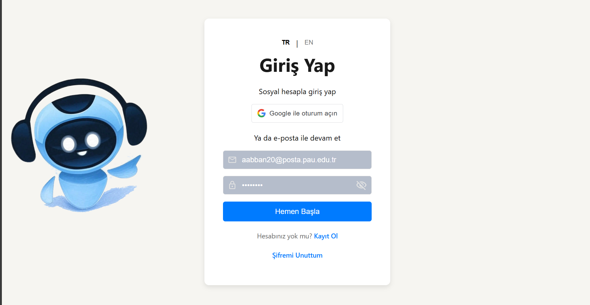
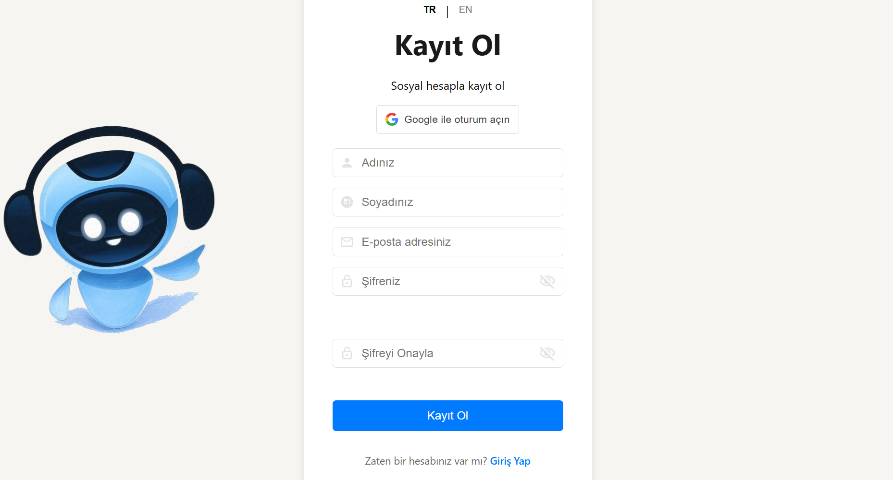
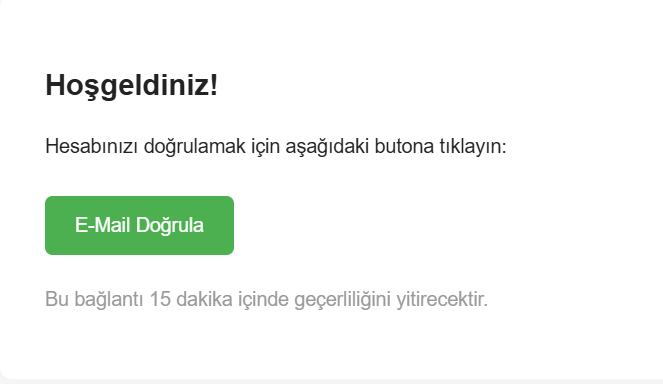
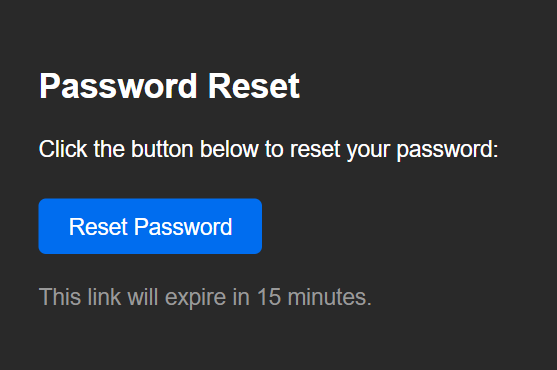
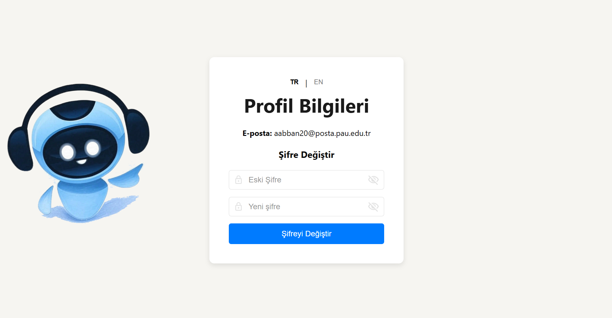
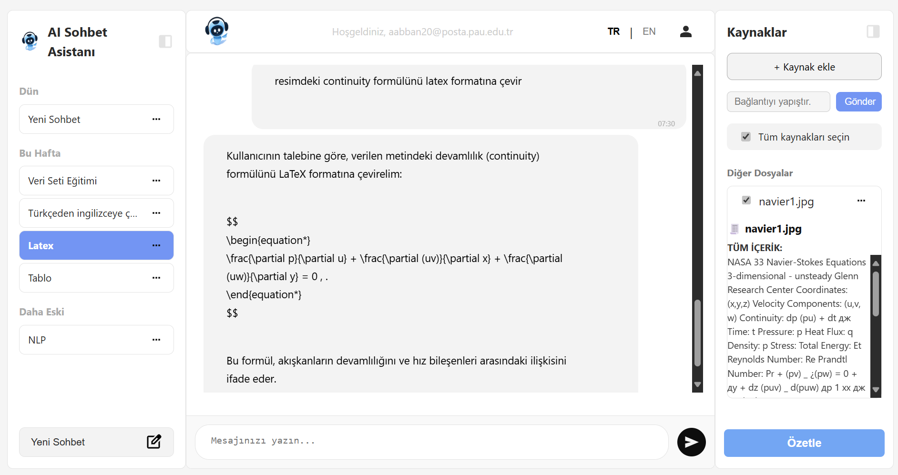
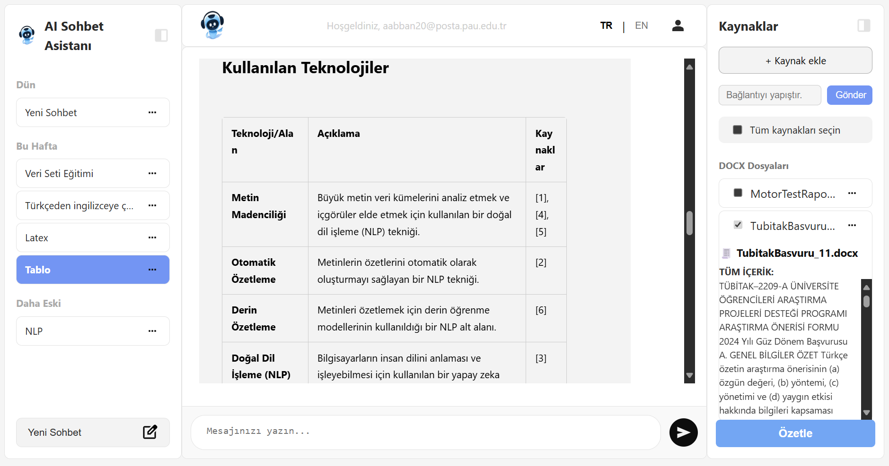
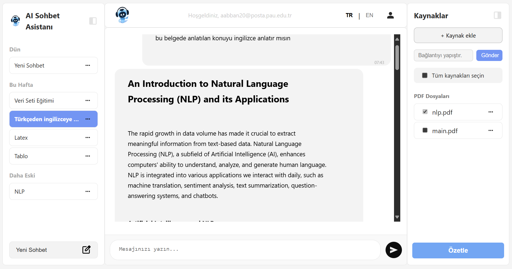

# 🧠 Yapay Zekâ Destekli Akıllı Asistan Uygulaması

Bu proje, kullanıcıların çok farklı türde kaynaklardan bilgi alabilmesini sağlayan, yapay zekâ ile güçlendirilmiş modern bir **dijital asistan** sistemidir. Sistem; PDF, Word, PowerPoint belgeleri, ses dosyaları (MP3), videolar (YouTube), haber metinleri ve web sayfaları gibi çoklu medya kaynaklarından metin çıkarımı yaparak; bu içerikleri **özetleyen**, kullanıcının sorularına içerik bağlamında **anlamlı cevaplar** üreten ve tüm bu işlemleri çok dilli destekle sunan gelişmiş bir bilgi erişim çözümüdür.

Tam yığın (fullstack) olarak geliştirilmiş bu sistem, frontend, backend ve AI mikroservis mimarisine sahiptir. Kullanıcı dostu bir arayüz üzerinden belge yükleme, sohbet başlatma, bağlantı ekleme gibi işlemler yapılabilir; sistem arka planda bu kaynakları işler, analiz eder ve yanıtlar üretir. Geliştirme süreci akademik yazılım mimarisi prensiplerine uygun şekilde planlanmıştır.

---

## 🚀 Temel Özellikler

- 📁 **Çoklu Medya Kaynağı Desteği:**  
  Kullanıcılar PDF, Word, PowerPoint, ses, video ve web bağlantılarını yükleyebilir. Sistem otomatik olarak içerik tipini tanır ve uygun işlem hattını başlatır.

- 🧠 **AI Tabanlı Özetleme & Soru-Cevap:**  
  Belgelerden çıkarılan metinler yapay zekâ mikroservisine gönderilir. Model, içeriği özetler ve kullanıcıdan gelen sorulara metne dayalı bağlamsal cevaplar üretir.

- 🌐 **Çok Dilli Destek (TR/EN):**  
  Arayüz, toast bildirimleri, e-posta şablonları ve model prompt'ları hem Türkçe hem İngilizce olarak desteklenir. Kullanıcının dil tercihi tüm sistem genelinde uygulanır.

- 📬 **E-posta Doğrulama ve Şifre Sıfırlama:**  
  Kullanıcı kayıtlarında doğrulama e-postası gönderilir. Ayrıca unutulan şifreler çok dilli e-posta şablonları ile sıfırlanabilir.

- 🔐 **JWT ile Güvenli Kimlik Doğrulama:**  
  Oturum yönetimi için kısa ömürlü access token ve uzun ömürlü refresh token yapısı kullanılır. Token'lar güvenli cookie üzerinden yönetilir.

- 💬 **Hafızalı Sohbet Sistemi:**  
  Her kullanıcı için ayrı sohbet odası oluşturulabilir. Yüklenen dosyalar ve yapılan konuşmalar odalara göre bağlamsal olarak saklanır ve analiz edilir.

- 🔍 **Otomatik Metin Çıkarımı:**  
  OCR (Optical Character Recognition) ile görsellerden, ASR (Automatic Speech Recognition) ile ses ve videolardan metin çıkarımı yapılır.

---

## 🧱 Kullanılan Teknolojiler

### 🎯 Frontend

- **React.js** – Bileşen tabanlı kullanıcı arayüzü
- **Vite** – Hızlı geliştirme ve üretim build sistemi
- **TailwindCSS** – Modern ve responsive UI tasarımı
- **Zustand** – Global state yönetimi (oturum, chat odaları vb.)
- **react-i18next** – Çoklu dil desteği altyapısı
- **Axios** – API bağlantıları ve token yönetimi
- **react-toastify** – Kullanıcı bildirimleri (başarı, hata, uyarı)

### ⚙️ Backend

- **Flask (Python)** – RESTful API mimarisi
- **MongoDB** – NoSQL veritabanı (kullanıcılar, belgeler, mesajlar, loglar)
- **JWT Authentication** – Access ve refresh token yapısıyla oturum kontrolü
- **Flask-Mail** – Doğrulama ve bildirim e-postaları
- **PyMuPDF, python-docx, BeautifulSoup** – Belgelerden metin çıkarımı
- **Newspaper3k** – Haber makalelerinden içerik çıkarımı
- **AssemblyAI** – Ses ve video transkriptleri
- **Google Vision API** – Görsel/elden yazılı OCR işlemleri

### 🤖 Yapay Zekâ Modeli (Microservice)

- **model_api** – Ayrı Flask sunucu olarak yapılandırılmış AI servisi
- **Dil modeli:** `Cohere Labs / aya-expanse-8b` (Hugging Face üzerinden erişim)
- **İşlev:** Soru-cevap (QA) ve özetleme (summarization) işlemlerini bağlamsal olarak yönetir

---

Bu proje, yapay zekâ teknolojileri ile bilgi erişimini kolaylaştırmak amacıyla geliştirilmiş; kullanıcı dostu, güvenli ve modüler bir asistan çözümüdür. Akademik, ticari veya bireysel kullanım senaryolarına uyarlanabilir yapıdadır.

## 📸 Ekran Görüntüleri

### 🔐 Giriş Ekranı

### 📝 Kayıt Ol Ekranı

### 📩 E-Posta Doğrulama

### 🔑 Şifre Sıfırlama (TR)

### 🔑 Şifre Sıfırlama (EN)

### 👤 Profil Bilgileri

### 🧠 LaTeX Formatında Formül Yanıtı

### 🧾 Chat ve PDF Tablosu

### 🌐 TR'den EN'ye Model Kullanımı

